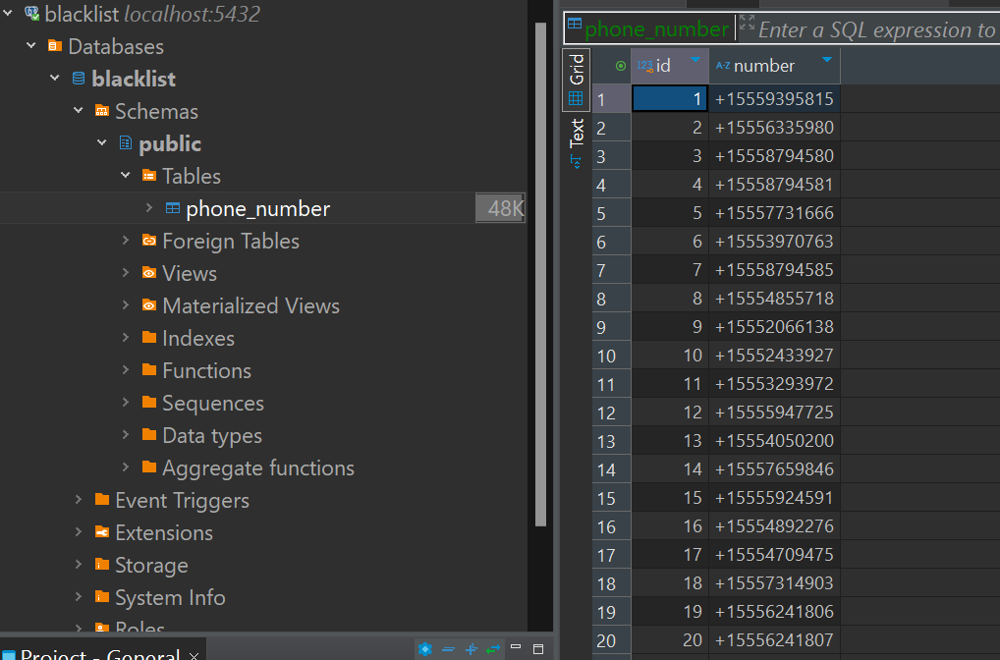

## NestJS Application with PostgreSQL - Docker Setup

This repository contains a Docker setup for a NestJS application that connects to a PostgreSQL database. The application is built using TypeScript and runs on Node.js.

I utilized docker for a streamlined and consistent workflow for enhacing collaboration and development speed.

### Prerequisites

Before begining, [Docker](https://docs.docker.com/get-docker/) should be installed

### Building the Docker Images:

The following command starts the application and the PostgreSQL database:

```bash
docker-compose up -d
```

`-d` is for running in the background and is optional

And to stop the running application and database containers, the following command is used:

```bash
docker-compose down
```

The database can be seen by using any db managment tool. I used DBeaver for easily usage and connection.


